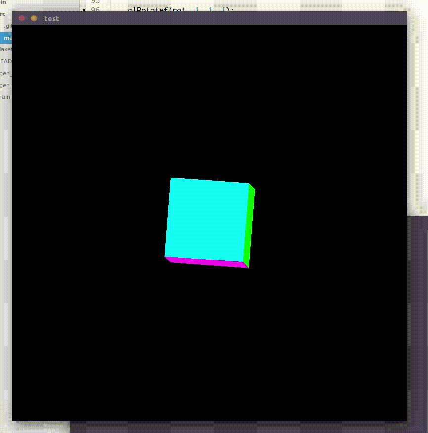

# [Alloy](http://alloy-lang.org) [](https://travis-ci.org/felixangell/alloy)

## Resources

* [Reference](/docs/REFERENCE.md)
* [Style Guide](/docs/STYLEGUIDE.md)
* [Tests](/tests/)
* [Libraries](/lib/)
* [Misc](/misc/)

## Example
<p align="center">

</p>
<p align="center">
Here's a 3d cube being rendered using SDL and OpenGL in Alloy. You can
check out the source code for this <a href="https://www.github.com/felixangell/space-invaders">here</a>
</p>

## Disclaimer?
Alloy is a somewhat experimental language, this means it can and probably will change at any point, be it a small change, or a complete re-write.

## Building
If you want to try out Alloy yourself, clone the repository, compile it, and add `bin/alloyc` to your path. You can
also run the test script (you'll need python) `test.py` to see if the tests work, though we can't guarantee they
will all run successfully if you're building the nightly.

### Requirements:
You will need:

* GNU Make
* Clang/GCC (we're not sure about other compilers support)
* Python 2.4 or above (optional, for the tests)

### Commands

	$ git clone http://www.github.com/felixangell/alloy
	$ cd alloy
	$ make

### Testing
Note that python is required.
If alloyc is in your `$PATH`:

	$ ./test.py

If alloyc is not in your `$PATH`:

	$ PATH=$PATH:"./bin/" ./test.py

## Status
Alloy is still constantly being worked on. At the moment it compiles,
however some aspects of the language are unimplemented or broken.

## Just show me what it looks like already
Sure, you can either see a small virtual machine implemented in Alloy [here](tests/misc/virtualmachine.aly). Or you can just see a small Hello World example below:

```rust
// c binding for printf
// you have to do this for now, but soon
// we'll have a standard library for this
fn printf(format: str, _): int;

fn main(): int {
    printf("Hello, World");
    return 0;
}
```

## How can I help out with Alloy?
There are loads of ways you can help out:

* Sending PR's (features, bug fixes, etc)
* Commenting on issues
* Creating issues (proposals, bugs, etc)
* Writing documentation

## License
Alloy is licensed under the [MIT License](/LICENSE.md).
